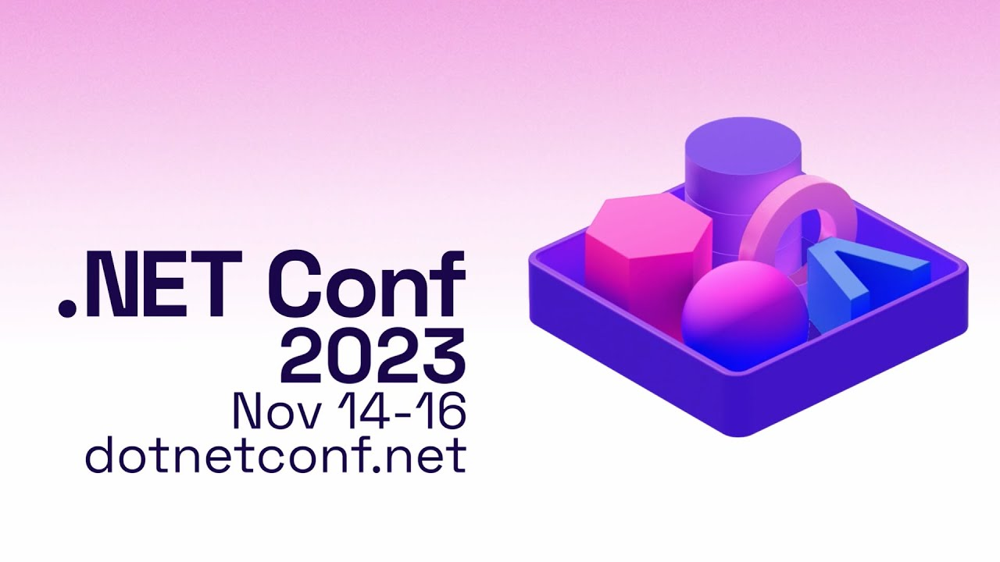

# .NET Conf 2023

Slides and samples from my .NET Conf 2023 session "Building 3D apps with .Net MAUI and Evergine"

## Resources
- Evergine: https://evergine.com
- .Net blog post: https://devblogs.microsoft.com/dotnet/dotnet-maui-3d-app-with-evergine/
- DotnetBot demo code: https://github.com/Jorgemagic/MAUIDotnet
- EverSneaks Showcase code: https://github.com/EvergineTeam/EverSneaks
- CarRental App UI Challenge: https://github.com/jsuarezruiz/netmaui-carrental-app-challenge
